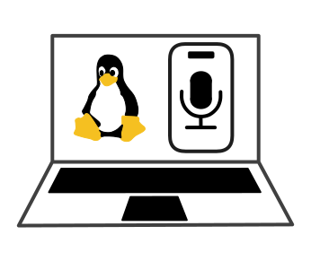

<p align="center">
  
</p>

# iosmic

Turn your iOS device into a microphone for Linux.

## Requirements

- Install and run this app on the iOS device: [DroidCam Webcam & OBS Camera](https://apps.apple.com/us/app/droidcam-webcam-obs-camera/id1510258102)
- For USB mode, install [usbmuxd](https://github.com/libimobiledevice/usbmuxd) on your Linux device.
- Install PulseAudio or PipeWire with its PulseAudio compatibility server and ALSA's [`pulse` plugin](https://github.com/alsa-project/alsa-plugins/).
    ```
    apk add alsa-plugins-pulse
    apt install libasound2-plugins
    dnf install alsa-plugins-pulseaudio
    pacman -S alsa-plugins
    xbps-install -S alsa-plugins-pulseaudio
    zypper install alsa-plugins-pulse
    ```

## Install

```sh
git clone https://github.com/magnickolas/iosmic
cargo install --path iosmic
```

For Wi-Fi only, omit USB support:

```sh
cargo install --path iosmic --no-default-features
```

## Basic Usage

Create a temporary `iosmic` microphone source and label it `iOS Microphone`:

```sh
iosmic
```

Create the same microphone source from a Wi-Fi connection:

```sh
iosmic -H <WiFi IP>
```

Run `iosmic -h` to see the help page with options.
